## Guide for Developing Terraform Modules

This repository is based on the template for creating Terraform modules. Therefore, certain rules must be followed for its development.

### Requirements

- Prior knowledge of Terraform
- Prior knowledge of the provider to be used
- Must have Make
- Must have Docker

### Rules

- Activate the hooks by running "make git-config" or consider the following before each commit
  - Autogenerate the README.md file with terraform-docs
  - Format the code (terraform fmt)
  - Validate the terraform code
  - Run the terraform tests (terraform test)
  - All commits must follow the [Angular convention](https://github.com/angular/angular/blob/master/CONTRIBUTING.md#commit)

## Structure of the most important files

- **:file_folder:.githooks/** (*)  
  - **:page_facing_up:commit-msg** *(validates that the commit message follows the Angular convention)*
  - **:page_facing_up:pre-commit** *(formats the code and updates README.md + git add modified .{tf,md} files)*
- **:file_folder:invocation-examples/** *(Deployment examples)*
  - **:file_folder:basic/** *(organization example)*
  - **:file_folder:example-1/** *(organization example)*
  - **:file_folder:speficic-case/** *(organization example)*
  - **:page_facing_up:.gitkeep** *(to track the empty folder)*
- **:page_facing_up:.editorconfig** *(configuration to standardize styles in different editors)*
- **:page_facing_up:.gitignore** *(configuration to not track files with git)*
- **:page_facing_up:.terraform-docs.yml** *(configuration for [terraform-docs](https://terraform-docs.io/))*
- **:page_facing_up:CONTRIBUTING.md** *(rules for collaborating on the project)*
- **:page_facing_up:data.tf** *(information defined outside of Terraform -or in another module-)*
- **:page_facing_up:main.tf** *(configuration for the submodule)*
- **:page_facing_up:Makefile**  (**)
- **:page_facing_up:outputs.tf** *(definition for the module outputs-info-)*
- **:page_facing_up:README.md** *(submodule documentation autogenerated with terraform-docs)*
- **:page_facing_up:variables.tf** *(variable-argument definitions for your module)*
- **:page_facing_up:VERSION** *(module version -will be used to create the tag-)*
- **:page_facing_up:versions.tf** *(configuration of the terraform and provider version)*

### .githooks (*)

The hooks are configured assuming that Docker and Make are available. Therefore, aliases/shortcuts are found within the Makefile.

If Docker or Make is not available

- Install both terraform and terraform-docs on your host
- For hook activation:
  - Do not run git-config, init, or init-vscode
  - Refer to the files in .githooks and Makefile to implement the hooks within .git/hooks
  
### Makefile (**)
  
- **git-config**: Configures the hooks by setting the path in .githooks.

- **td-readme**: Runs terraform-docs to create/update README.md files.

- **tf-fmt**: Runs terraform fmt to format the code.

- **tf-init**: Initializes the Terraform configuration without a backend.

- **tf-validate**: Initializes and validates the Terraform code.

- **tf-test**: Execute "terraform test" without implications currently.

- **pre-commit**: Runs a series of commands before allowing a commit.

- **install-vscode-extensions**: Installs the recommended extensions for VSCode.

- **init**: Configures the necessary settings for the module.

- **init-vscode**: Runs init and installs VSCode extensions.

---

## Source-Control Branching Model (SCBM)

For the development of Terraform modules, we will base ourselves on [Trunk-Based Development (TBD)](https://trunkbaseddevelopment.com/).

We will have a single permanent branch called "main".

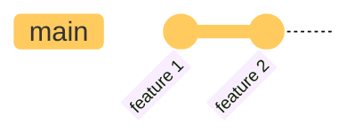

### Commit

Each time a new functionality is to be added, a new branch must be created from "main" and a PR must be requested. The GitHub rule "Require linear history" will be activated, so base yourself on one of the following strategies for the commit and respect the [Angular convention](https://github.com/angular/angular/blob/master/CONTRIBUTING.md#commit).

If you have the hooks active, the following will be triggered:

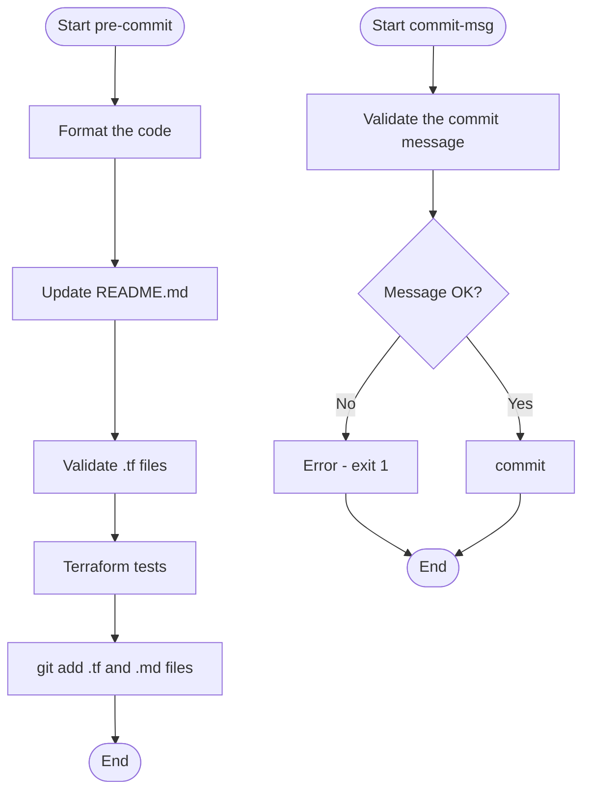

**merge**

To apply merge, first update the feature branch with the new commits from "main". After resolving any conflicts, generate the commit.

**rebase**

To apply rebase, first update the master branch and then apply the rebase on the feature branch and resolve any conflicts.

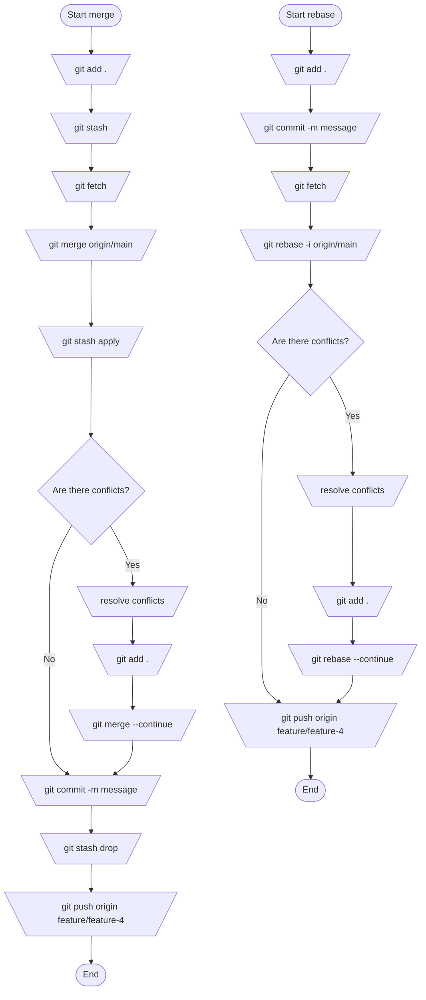

### Pull Request
<!-- @import "[TOC]" {cmd="toc" depthFrom=1 depthTo=6 orderedList=false} -->

Once the commit is generated, you can proceed to request a PR to "main". If the corresponding validations were satisfactory and the PR is accepted by someone from the CODEOWNERS, you can proceed with the merge.

**GitHub Workflow: pull-request.yml**

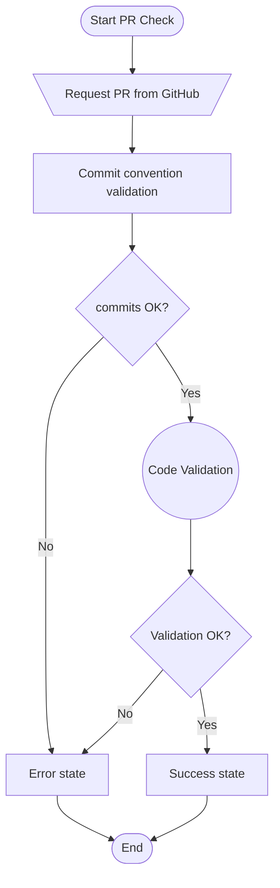

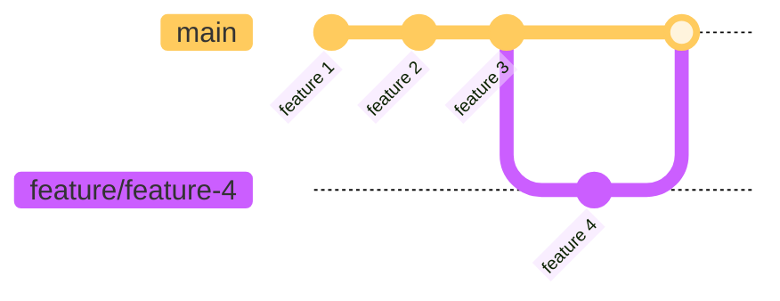

It will also be configured that all source branches are deleted after the PR merge

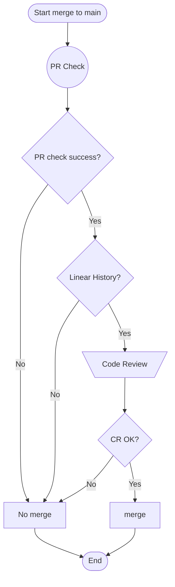

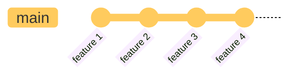

### Release

To generate a release, run the GitHub Workflow "Create Release" (release.yml). This will generate the tag and release on GitHub.

**GitHub Workflow: release.yml**

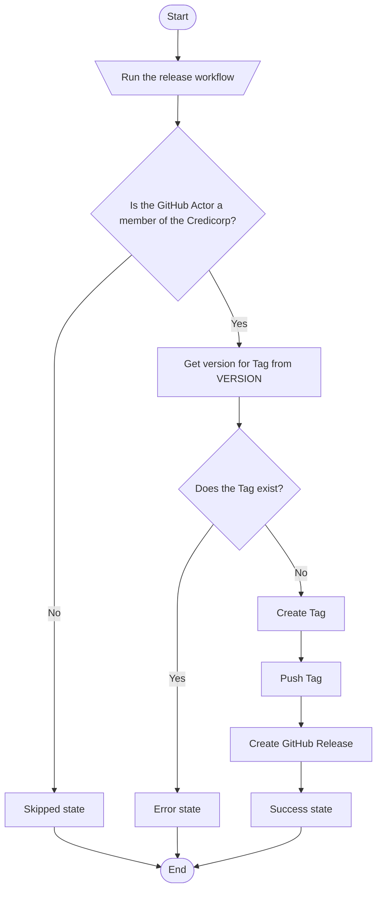

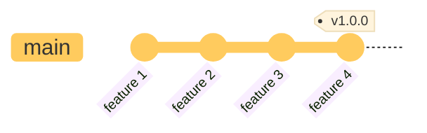

### New Release

The workflow will remain linear and continue towards the new version, maintaining the established rules and working on it.

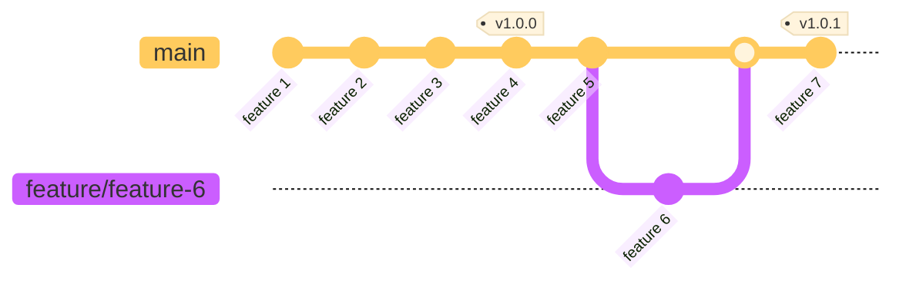

## Rules
>
> **Here all the rules related to the repository will be explained**.

### Repository Configuration

- Activate the GitHub rules "Require linear history" and "Delete head branches"
- No one can bypass PR or any GitHub rule
- No one can delete tags
- Protected tags must have the nomenclature `v*, v1*, etc`
  - All release tags will be protected
- Only GitHub Host Runners are used

### Branch Protection

- A PR is required before merging to "main"
- PRs need at least 1 validations
- It will only proceed with merging to "main" if the PR has a "success" status check
- The branch must be up to date before being merged
- The "main" branch does not allow "force pushes"
- Only the CODEOWNERS can review PRs

---

## Step-by-step of the GitHub Workflows with each tool used

### Pull Request

This workflow, called "Pull Request Check", is automatically triggered
when a Pull Request is opened towards the master branch in the repository. The main purpose
is to execute verification and validation processes before merging changes into the main branch.

```mermaid
flowchart LR
    i1([Start PR Check]) --> B[Git Config]
    B --> C[Checkout]
    C --> D[Convention Validation Commits]
    D --> E[Setup Terraform]
    E --> F[Terraform Fmt]
    F --> G[Terraform Init]
    G --> H[Terraform Validate]
    H --> I[Terraform Test]
    I --> J[Tfsec GitHub Action]
    J --> K[Upload SARIF file]
    K --> M[Validate Documentation]
    M --> L[End]
```

### New Release

This GitHub Actions workflow is designed to automate the process of creating a new tag and release on GitHub.

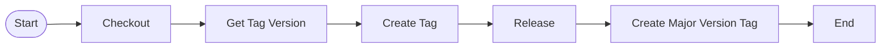
